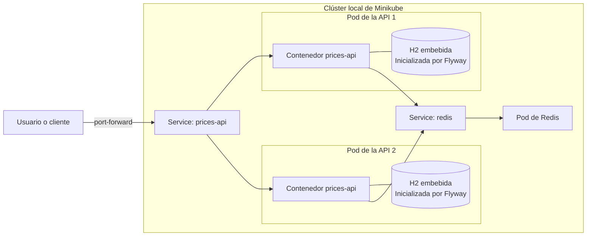

# Despliegue local en Kubernetes con Minikube

## Introducción

El microservicio de precios puede ejecutarse directamente con Maven o junto con Redis mediante Docker Compose. El directorio `k8s/` ofrece una tercera opción, de carácter opcional: desplegar la aplicación y Redis en un clúster local de Kubernetes.

Minikube permite ejecutar un pequeño clúster de Kubernetes en el equipo de desarrollo. Aquí se utiliza para mostrar cómo se puede empaquetar el servicio en una imagen de contenedor, configurarlo, desplegarlo, exponerlo dentro de un clúster y supervisarlo con Kubernetes. Esto no convierte la prueba técnica en una plataforma de producción y el despliegue no se realiza automáticamente.

No es necesario disponer de Minikube para revisar la aplicación principal, ejecutarla con Maven o Docker Compose ni lanzar la suite de tests. Solo hace falta para reproducir la demostración local con Kubernetes.

## Por qué se incluye Kubernetes

La extensión de Kubernetes muestra aspectos del despliegue que se mantienen deliberadamente fuera del código de negocio. Separa la API y Redis en workloads independientes, los conecta mediante el DNS de Kubernetes y traslada la configuración no sensible de ejecución a un ConfigMap. También permite ejecutar dos réplicas de la API y demostrar el uso de sondas de salud, actualizaciones progresivas, controles de recursos y restricciones de seguridad en los contenedores.

Este entorno también permite observar la aplicación cuando Redis deja de estar disponible. La API está diseñada para seguir consultando precios en su base de datos H2 embebida mientras las operaciones de caché aplican una estrategia fail-open. Así, Kubernetes puede reflejar la degradación de esa dependencia sin reiniciar pods de la API que siguen estando sanos.

Kubernetes no modifica la arquitectura hexagonal ni las reglas de precios. Es una capa de despliegue situada fuera de los paquetes `domain` y `application`; esas capas no dependen de los manifiestos ni de Minikube.

## Qué simula el entorno local

El despliegue simula un pequeño clúster que contiene:

- Dos instancias reemplazables, o pods, de la API de precios.
- Un Service estable de Kubernetes delante de esos pods.
- Un pod de Redis independiente detrás de su propio Service interno.
- Comunicación privada entre la API y Redis dentro del clúster.
- Supervisión de la salud de los contenedores mediante sondas.
- Sustitución progresiva de pods durante una actualización de la API.

Los pods son unidades de ejecución desechables: Kubernetes puede reemplazarlos y asignarles nuevas direcciones IP. Los Services proporcionan nombres y direcciones virtuales estables, por lo que los clientes y otros workloads no necesitan saber qué pod atiende una petición en cada momento. La API utiliza el nombre DNS `redis` en lugar de la dirección de un pod concreto de Redis.

## Diagrama de arquitectura



Kubernetes puede dirigir cada petición entrante a cualquiera de las dos réplicas de la API. Ambas utilizan Redis como caché compartida, pero no comparten H2: cada pod de la API tiene su propia base de datos en memoria, cargada con las mismas migraciones y los mismos datos iniciales de Flyway.

## Recursos de Kubernetes

Los manifiestos son deliberadamente pequeños y se componen con Kustomize, en lugar de duplicarse en un archivo de despliegue generado.

| Recurso | Finalidad | Decisión principal |
| --- | --- | --- |
| `namespace.yaml` | Crea el namespace `prices` para los recursos locales. | Mantiene la demostración aislada de los workloads de otros namespaces. |
| `configmap.yaml` | Proporciona la configuración no sensible de Spring, Redis, las sondas y el apagado. | Utiliza los nombres reales de las propiedades de entorno y no contiene secretos ficticios. |
| `prices-api-deployment.yaml` | Ejecuta y supervisa dos pods de la API. | Utiliza la imagen local, actualizaciones progresivas, sondas específicas, controles de recursos y contextos de seguridad restrictivos. |
| `prices-api-service.yaml` | Proporciona a las réplicas una dirección estable dentro del clúster. | Utiliza un `ClusterIP` interno; el acceso local se habilita temporalmente mediante port-forward. |
| `redis-deployment.yaml` | Ejecuta una instancia efímera de Redis. | Desactiva RDB y AOF porque Redis solo actúa como caché reconstruible. |
| `redis-service.yaml` | Proporciona el nombre DNS interno y el puerto que utiliza la API. | Utiliza un `ClusterIP` y no expone Redis fuera del clúster. |
| `kustomization.yaml` | Agrupa los manifiestos y aplica el namespace `prices`. | Permite renderizar y aplicar el despliegue completo mediante `kubectl -k`. |

## Decisiones de diseño importantes

### Imagen local

La imagen `prices-microservice:local` se construye a partir del Dockerfile existente y se carga directamente en el perfil `prices` de Minikube. No es necesario publicarla en Docker Hub ni en otro registry. El Deployment de la API utiliza `imagePullPolicy: Never` para hacer explícito este flujo local: la imagen debe existir previamente en el perfil seleccionado.

### Dos réplicas de la API

Las dos réplicas demuestran que el procesamiento de peticiones no está ligado a la memoria de un único proceso Java. Redis proporciona una caché compartida, mientras que cada pod conserva su propia instancia H2 embebida con datos idénticos inicializados por Flyway.

Esta disposición es válida para la demostración porque los datos iniciales son de solo lectura y deterministas. Una base H2 independiente por pod no sería adecuada para un sistema de producción con escrituras compartidas; un sistema así utilizaría normalmente una base de datos compartida y duradera.

### Redis como optimización opcional

Redis mejora las consultas repetidas, pero no es la fuente autoritativa de los datos de precios. Cuando no existe un valor en caché, la aplicación consulta H2. Los errores de lectura y escritura se gestionan con una estrategia fail-open, por lo que una caída puede reducir el rendimiento, pero no debería impedir consultas válidas.

Por ello, Redis se ejecuta como caché efímera, sin snapshots RDB, persistencia AOF ni PersistentVolumeClaim. Sus entradas pueden reconstruirse desde H2 después de reemplazar el pod.

### Sondas de salud

Las distintas comprobaciones de salud tienen responsabilidades diferentes:

- La sonda de arranque da tiempo al proceso Java para inicializarse antes de las comprobaciones normales de liveness y readiness.
- La sonda de liveness consulta `/actuator/health/liveness` para determinar si el proceso sigue siendo recuperable. Los fallos repetidos pueden reiniciar el contenedor.
- La sonda de readiness consulta `/actuator/health/readiness` para decidir si un pod puede seguir recibiendo tráfico.
- El endpoint agregado `/actuator/health` informa del estado global, incluido Redis.

Redis se excluye deliberadamente de los grupos de liveness y readiness. Si falla, el endpoint agregado informa de `DOWN`, mientras las sondas permanecen en `UP` y las consultas continúan mediante H2. Usar el endpoint agregado como liveness sería incorrecto: una caída de la caché provocaría reinicios innecesarios sin reparar Redis.

### Seguridad

Ambos contenedores se ejecutan con usuarios no root y filesystems raíz de solo lectura. La escalada de privilegios está deshabilitada, se eliminan todas las capabilities de Linux y se aplica `seccompProfile: RuntimeDefault`. No se montan tokens de cuentas de servicio ni se utilizan `hostNetwork`, `hostPath` o el socket de Docker. Redis permanece privado dentro del clúster.

El almacenamiento escribible se limita a volúmenes `emptyDir` de tamaño restringido para `/tmp` y `/data`. Estas medidas reducen la superficie de ataque incluso en un entorno local.

### Gestión de recursos

Los requests indican a Kubernetes cuánta capacidad debe reservar al planificar un pod. Los limits evitan que un contenedor consuma CPU o memoria sin un límite superior.

| Componente | Request de CPU | Request de memoria | Límite de CPU | Límite de memoria |
| --- | ---: | ---: | ---: | ---: |
| API | 200m | 384Mi | 1 | 768Mi |
| Redis | 50m | 64Mi | 250m | 256Mi |

## Requisitos previos

Para reproducir el despliegue opcional en Kubernetes se necesita:

- Docker Desktop ejecutándose con contenedores Linux.
- Minikube.
- `kubectl`.
- Capacidad local suficiente para un perfil con 4 CPU y 6144 MB de memoria.

Estas herramientas y recursos solo son necesarios para el despliegue en Kubernetes. No hacen falta para revisar el código ni ejecutar los tests de Maven.

## Ejecución del despliegue

Inicia o reutiliza el perfil indicado y selecciona su contexto:

```powershell
minikube start -p prices --driver=docker --cpus=4 --memory=6144
kubectl config use-context prices
```

Construye la imagen en local y cópiala a ese perfil:

```powershell
docker build -t prices-microservice:local .
minikube image load prices-microservice:local -p prices
```

Aplica Kustomize, espera ambos despliegues y comprueba su estado:

```powershell
kubectl apply -k k8s
kubectl rollout status deployment/redis -n prices
kubectl rollout status deployment/prices-api -n prices
kubectl get pods,services -n prices
```

Estos comandos realizan un despliegue local explícito. Iniciar Minikube por sí solo no despliega la aplicación.

## Acceso a la API

Redirige un puerto local al Service interno y mantén el comando activo durante las peticiones:

```powershell
kubectl port-forward -n prices service/prices-api 8080:8080
```

En otra terminal de PowerShell, consulta el precio aplicable a las 16:00 del 14 de junio de 2020:

```powershell
curl.exe "http://localhost:8080/api/v1/prices/current?applicationDate=2020-06-14T16:00:00&productId=35455&brandId=1"
```

La respuesta debería ser HTTP 200 e incluir `"priceList":2`, `"price":25.45` y `"currency":"EUR"`.

El mismo port-forward permite acceder a estos endpoints:

- Salud agregada: <http://localhost:8080/actuator/health>
- Documento OpenAPI: <http://localhost:8080/v3/api-docs>
- Interfaz de Swagger: <http://localhost:8080/swagger-ui.html>

## Demostración del comportamiento fail-open

Redis puede detenerse temporalmente para observar el comportamiento ante un fallo de la caché:

```powershell
kubectl scale deployment/redis --replicas=0 -n prices
kubectl get pods -n prices
```

Utiliza una consulta cuya clave no esté ya almacenada. Las peticiones deberían seguir devolviendo datos desde H2. `/actuator/health` debería reflejar la degradación relacionada con Redis, mientras `/actuator/health/liveness` y `/actuator/health/readiness` permanecen en `UP`. Los pods deberían seguir Ready y no reiniciarse.

Restaura Redis después de la demostración:

```powershell
kubectl scale deployment/redis --replicas=1 -n prices
kubectl rollout status deployment/redis -n prices
```

Durante esta prueba es normal que aparezcan avisos de fallo de conexión y reconexión. Las escrituras en Redis se reanudan cuando el cliente vuelve a conectarse.

## Limpieza

Elimina los recursos descritos por la configuración de Kustomize:

```powershell
kubectl delete -k k8s
```

Esto elimina los recursos, incluido el namespace `prices`, pero conserva el perfil de Minikube. El perfil se puede detener de forma opcional:

```powershell
minikube stop -p prices
```

No es necesario ejecutar `minikube delete` para este flujo.

## Carácter opcional

Kubernetes es una extensión opcional. El microservicio puede revisarse y ejecutarse sin Minikube, y los manifiestos no alteran los flujos de Maven ni Docker Compose. Las decisiones pueden evaluarse leyendo los YAML y este documento sin iniciar un clúster. Minikube solo hace falta para reproducir la demostración completa.
